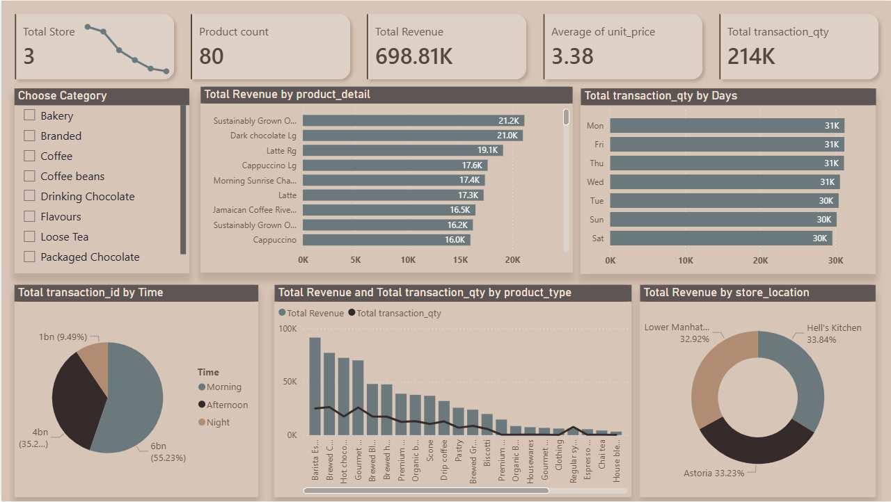

# ☕ Coffee Sales Analysis | Power BI Dashboard

## 🔍 About the Project
This project showcases an end-to-end **data analysis and visualization** workflow using **Power BI**.  
The dashboard analyzes coffee shop sales data to uncover **revenue trends, customer behavior, and product performance**, transforming raw data into actionable insights for business decision-making.

---

## 🧠 Business Problem
Coffee shop managers need to understand:
- Which products generate the highest revenue
- Peak sales times and days
- Performance differences across store locations
- Customer purchasing behavior patterns

This dashboard answers these questions through interactive visuals and KPIs.

---

## 🎯 Analysis Objectives
- Measure overall sales performance
- Identify top and low-performing products
- Analyze transaction volume by time and day
- Compare revenue contribution by store location
- Enable dynamic filtering by product category

---

## 📊 Dashboard Overview

### Key KPIs
- **Total Stores**
- **Product Count**
- **Total Revenue**
- **Average Unit Price**
- **Total Transaction Quantity**

### Visual Analysis
- **Total Revenue by Product Detail**
- **Total Revenue & Transaction Quantity by Product Type**
- **Transaction Quantity by Day**
- **Transactions by Time (Morning / Afternoon / Night)**
- **Revenue Distribution by Store Location**

### Interactivity
- Category slicer for focused analysis
- Dynamic visuals responding to user selection

---

## 🖼 Dashboard Preview

---

## 📈 Key Insights
- Morning time generates the highest number of transactions
- A small group of products contributes a large share of total revenue
- Coffee-related products outperform other categories
- Revenue distribution across store locations is relatively balanced
- Weekdays show slightly higher transaction volumes than weekends

---

## 🛠 Tools & Skills Used
- **Power BI**
- **Power Query** (Data Cleaning & Transformation)
- **DAX** (Measures & KPIs)
- **Data Modeling**
- **Business & Sales Analysis**
- **Data Visualization Best Practices**

---

## 🚀 How to Run the Project
1. Download the `.pbix` file from the repository
2. Open it using **Power BI Desktop**
3. Explore insights using slicers and visuals

---

## 👩‍💻 Author
**Marwa Mohamed Aboelela**  
Data Analyst | Power BI Developer  

- GitHub: https://github.com/marwamohamed51

---

⭐ If you find this project useful, feel free to star the repository!

## 📂 Project Structure
